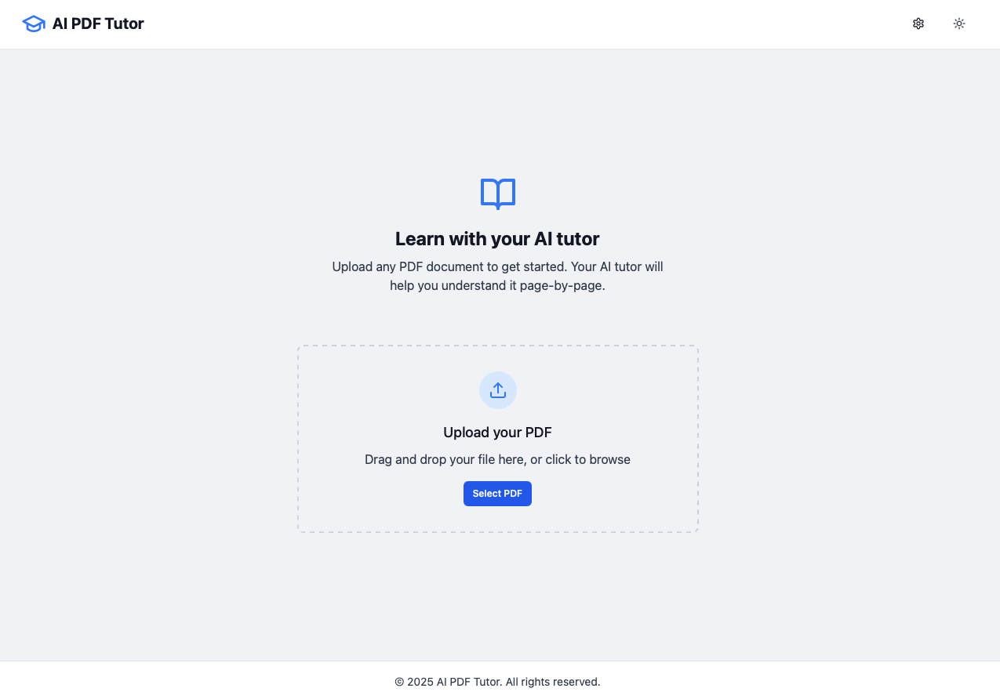
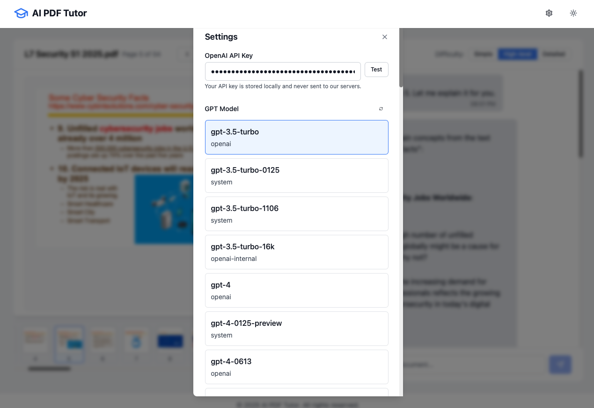

# AI PDF Tutor 📚

[](https://opensource.org/licenses/MIT)
[](https://www.typescriptlang.org/)
[](https://reactjs.org/)
[](https://vitejs.dev/)
[](https://tailwindcss.com/)

A cross-platform personal AI tutor that ingests PDFs, explains them page-by-page, and holds an interactive Q&A chat.

## 🖼️ Project Demo

### Homepage



### PDF Content View


### Settings Panel



---

## 🌟 Features

- **PDF Processing**: Upload and process any PDF document with automatic text extraction
- **AI-Powered Explanations**: Get page-by-page explanations tailored to your understanding level
- **Interactive Chat**: Ask questions about the document and receive contextual answers
- **Multiple Tutor Personalities**: Choose from different teaching styles or create your own
- **Customizable Difficulty Levels**: Select from simple, high-level, or detailed explanations
- **Dark Mode Support**: Comfortable reading experience in any lighting condition
- **Document History**: Quick access to previously studied documents with saved chat sessions
- **Markdown Support**: Rich text formatting for AI responses with code syntax highlighting
- **Responsive Design**: Seamless experience across desktop and mobile devices

## 🚀 Getting Started

### Prerequisites

- Node.js 18.0 or higher
- OpenAI API key

### Installation

1. Clone the repository:

   ```bash
   git clone https://github.com/yourusername/ai-pdf-tutor.git
   cd ai-pdf-tutor
   ```

2. Install dependencies:

   ```bash
   npm install
   ```

3. Create a `.env` file in the project root:

   ```env
   VITE_OPENAI_API_KEY=your_api_key_here
   ```

4. Start the development server:
   ```bash
   npm run dev
   ```

## 🛠️ Tech Stack

- **Frontend Framework**: React with TypeScript
- **Build Tool**: Vite
- **Styling**: Tailwind CSS
- **PDF Processing**: PDF.js
- **AI Integration**: OpenAI API
- **Icons**: Lucide React
- **UI Components**: Custom components with Radix UI primitives
- **Markdown Rendering**: React Markdown with syntax highlighting

## 📖 Project Structure

```
src/
├── components/         # React components
│   ├── ui/            # Reusable UI components
│   └── ...            # Feature-specific components
├── contexts/          # React context providers
├── types/             # TypeScript type definitions
├── utils/             # Utility functions
└── ...                # Other source files
```

## 🤝 Contributing

1. Fork the repository
2. Create your feature branch (`git checkout -b feature/AmazingFeature`)
3. Commit your changes (`git commit -m 'Add some AmazingFeature'`)
4. Push to the branch (`git push origin feature/AmazingFeature`)
5. Open a Pull Request

## 📝 License

This project is licensed under the MIT License - see the [LICENSE](LICENSE) file for details.

## 🙏 Acknowledgments

- [OpenAI](https://openai.com/) for providing the AI capabilities
- [PDF.js](https://mozilla.github.io/pdf.js/) for PDF processing
- [Tailwind CSS](https://tailwindcss.com/) for the styling system
- [Lucide](https://lucide.dev/) for the beautiful icons

## 📬 Contact

Your Name - [@Gaoyuan Hao](https://twitter.com/gaoyuan Hao) - hgy13952044339@outlook.com

Project Link: [https://github.com/yourusername/ai-pdf-tutor](https://github.com/yourusername/ai-pdf-tutor)
